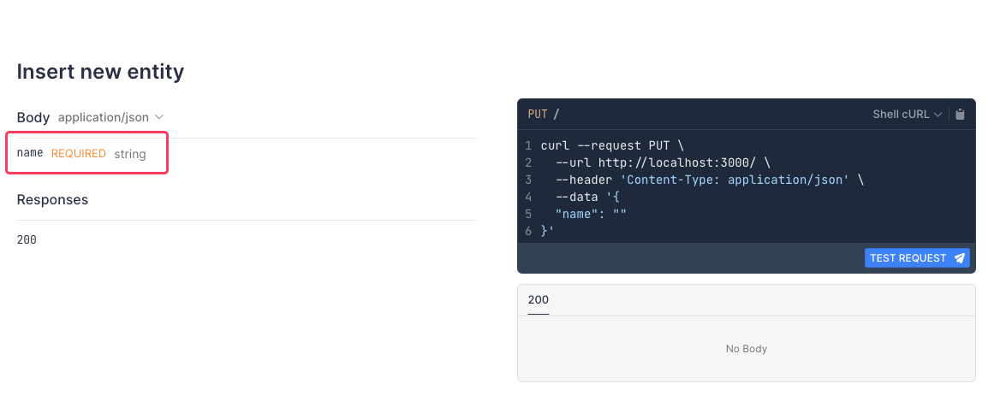
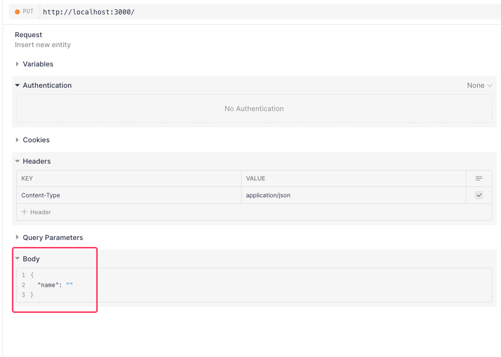

# Elysia Drizzle Schema

Simple [Elysia.js](https://elysiajs.com) plugin that helps to use [Drizzle ORM](https://orm.drizzle.team/) schema inside elysia swagger [model](https://elysiajs.com/validation/reference-model.html#reference-model).

> Only Postgresql (via pg-core) was supported now

## Requirements

- bun
- Drizzle ORM
- Elysia.js

## Install

```bash
bun i elysia-drizzle-schema
```
or 
```bash
npm i elysia-drizzle-schema
```

## Usage

```ts
import { foo } from "../db/schema";
import { parseDrizzleModel, type optionsParams } from "./elysia-drizzle";
import type { PgTable } from "drizzle-orm/pg-core";

const app = new Elysia();

app
  .use(swagger())
  .model({
    foo: parseDrizzleModel(
      <PgTable>foo,
      <optionsParams>{ exludedColumns: ["id", "uuid"] }
    ),
  })
  .put("/", requestController.insert, {
    body: "test",
    detail: {
      summary: "Insert new entity",
    },
  })
  .listener(3000);
```

## Defaults

`optionsParams` defines the default settings. The accepted parameters are:

- `excludePrimaryKey: boolean`: to programmatically skip the `id` field
- `excludedColumns?: Array<string>`: list of extra fields to be skipped

## Result

It will dynamically load the parameters of the POST body:



